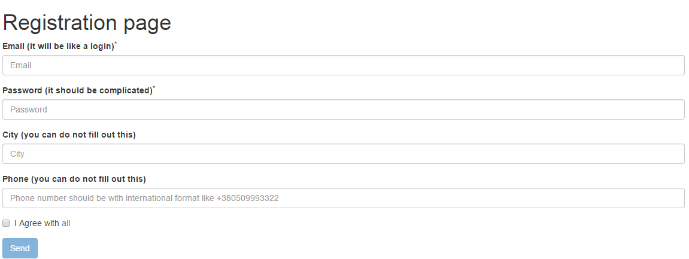
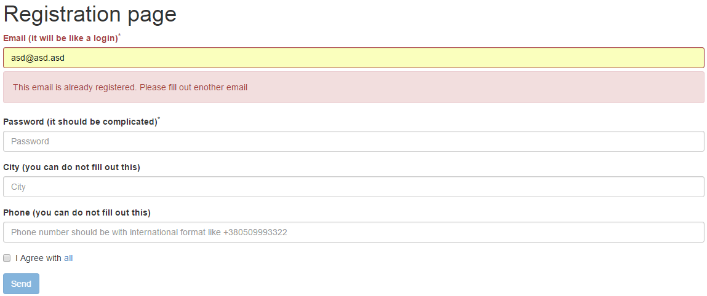

# Form-Validation
# Task:
To create a validation form:

1. Form should has required fields(`email`, `password`).
2. Form shouldn't send with empry or wrong text in the required fields. Examples of user mistakes:
	- required field do not fill out.
	- email mistakes.
	- the password is too small.
	- simple password(only letters or only digits).
	- do not `click` checkbox `I Agree with all`.
	- etc.
	
	Check all user mistakes by `RegExp`.
3. Check by `AJAX` email name on `https://aqueous-reaches-8130.herokuapp.com` - email validation server. If email is `true`(registered) - inform user about this.
4. Send-button should has `disable` if form has any mistakes.
5. Form should work in all browsers since IE9.

empty form

form with mistake

