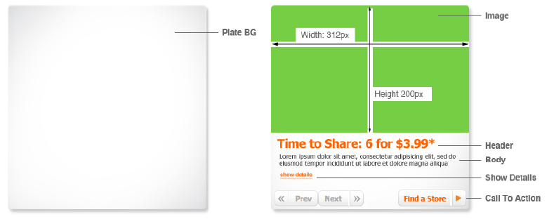
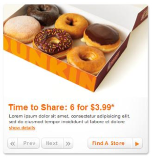

# Info-Box
# Task:
To create widget - Info-Box:

1. Content should take from `json/info_box.json`.
2. Widget should be the same as - `artifacts/info_box.swf` (play this).
3. Widget should work in all browsers since IE9.

specification

visualisation

