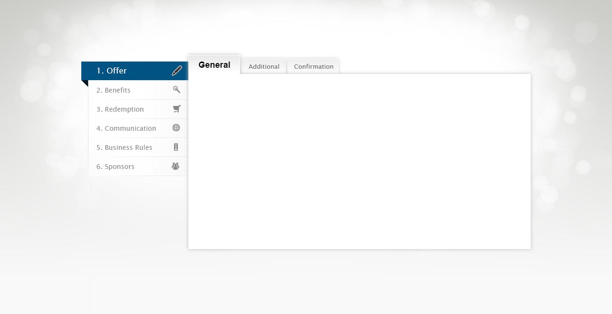
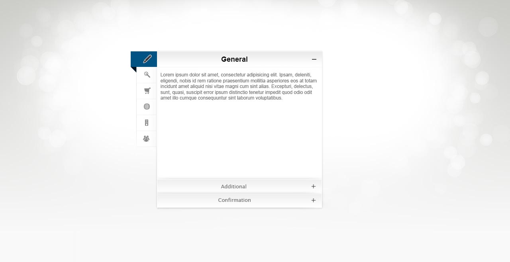

# Sidebar-Tab
# Task:
To create response page layout from .psd. The page should work in latest browsers since IE10.

To create script(whithout any library) for `tabs`:

1. In load page should show first `hashtag`. If `url` have no `hashtag` the `hashtag` should add automatically (for example: `example.com/#general`.
2. IF `url` have no `hashtag` - current `hashtag` should be (for example: `example.com/#additional`).
3. IF `tab` switch - current `hashtag` should chenge.
4. IF page load with `hashtag`- active `tab` should be  (for example: `example.com/#additional` - `Additional`).

