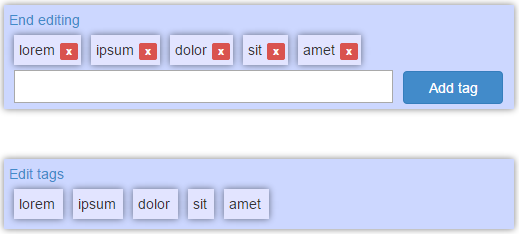

# Tag-List
# Task:
To create widget - `TagList`.

1. Widget can switch between `view mode` and `edit mode`. It should have 1 button for switch.
2. `TagList` can be with start tags (which can transmit in `arguments`).
3. Page can have a lot of `TagList`.
4. In `edit mode` `tags` can be add and delete.

